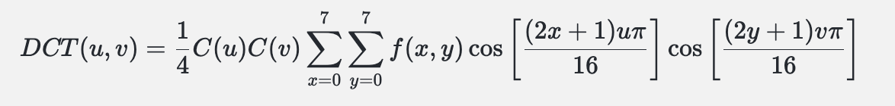
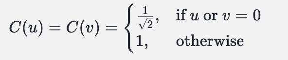

# 这段代码实现了图像的离散余弦变换（Discrete Cosine Transform, DCT），通常用于图像和视频压缩，例如JPEG压缩。代码中定义了几个函数

## alpha(u) 函数:
这个函数用于计算DCT变换中的缩放因子。对于一维DCT，当u为0时，返回1/√8，否则返回1/2。这是为了满足DCT变换的正交化要求。

## block_fill(block) 函数:
这个函数用于将一个小于8x8的图像块填充到8x8的尺寸。它首先创建一个8x8的零矩阵dst，然后将输入的图像块block复制到dst的左上角。这样做是为了处理边缘情况，当图像的宽度或高度不是8的倍数时，最后的几个块可能会小于8x8。

## DCT_block(img) 函数:
这个函数执行单个8x8像素块的二维DCT变换。首先，它调用block_fill函数将图像块填充到8x8的尺寸。然后将像素值从无符号整型转换为32位浮点型，并减去128以将像素值中心化到[-128, 127]的范围。接着，它通过嵌套的四个循环计算DCT系数。外部两个循环遍历DCT系数的位置，内部两个循环计算DCT变换的和。最后，使用alpha函数对每个系数进行缩放，并返回经过np.ceil函数向上取整后的结果。

## DCT(image) 函数:
这个函数对整个图像进行DCT变换。它首先计算图像可以分成多少个8x8的块。然后，使用两个嵌套循环遍历这些块。对于每个块，它调用DCT_block函数进行DCT变换，并将变换后的块添加到列表dlist中。最后，返回这个列表，列表中的每个元素都是一个8x8的DCT变换后的块。

实现二维DCT变换而不使用外部库，你需要自己实现DCT的数学公式。二维DCT的公式如下：
    

其中,f(x,y)是输入图像块中位置(x,y)的像素值,DCT(u,v)是变换后的值,C(u)C(v)是归一化系数：
    
